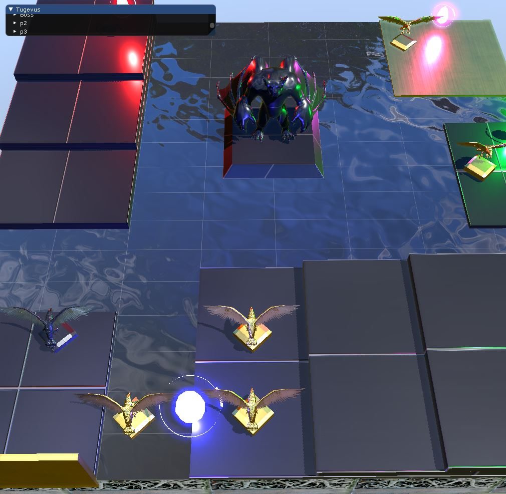
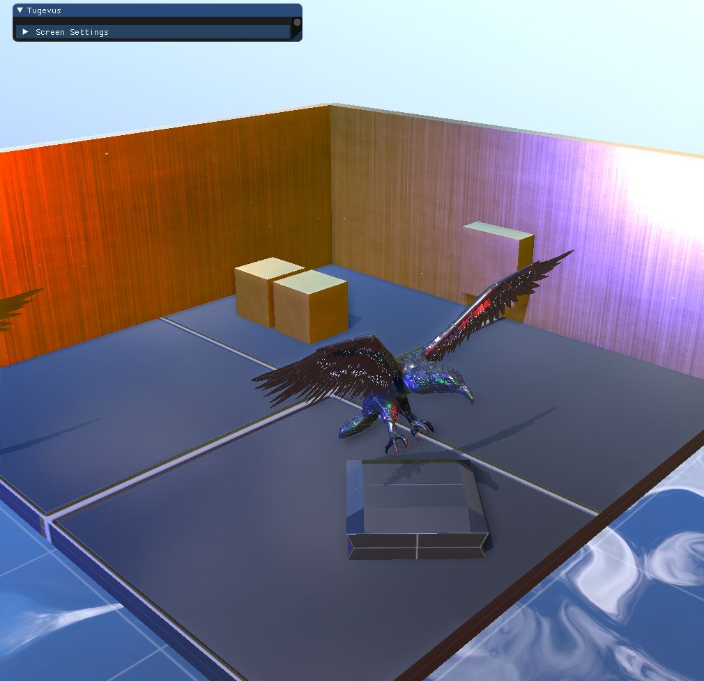
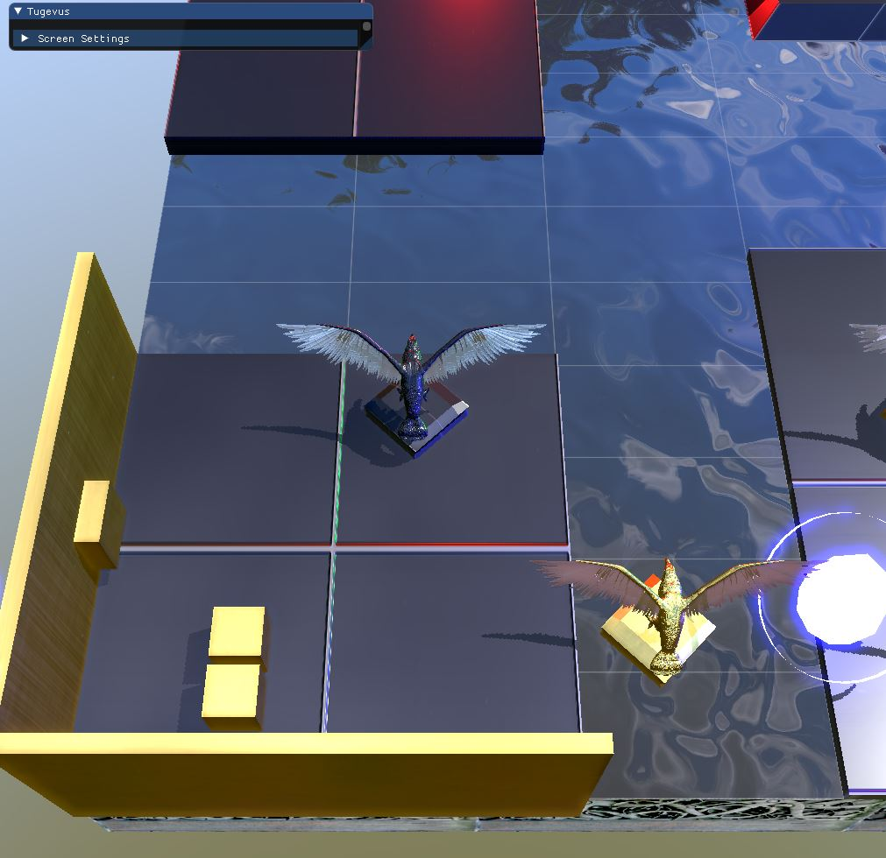

INTRODUCTION

This Vulkan render application with intent to demonstrate some graphics techniques  and  get familiarity with the new KhrounosGroup API .

The inspiration for the scene was a top down game inspired in Yugioh Capsule Monster,although I have pretty basic skills in art and design of scenarios. Besides the graphics rendering, the program features some very basic game engine concepts such as Entity-Component relation.

The Render features some topics like PBR Lighting , Directional Shadow Map calculated based on camera frustum , irradiance map and Specular reflections  with Image Based Light using the Epic Games the split sum approximation.It also features screen space occlusion which uses 56 samples to calculate an occlusion factor. 

The illumination is done in  a deferred render pass, the deferred pass uses a geometry pass which consists of a collection of buffers that hold geometry information of the scene. The Gbuffer is very convenient  to study another graphics algorithms like reflective shadow map and RSSAO. 

The frame creation process consists of 7 Renderpasses : 

Renderpass 1  - Creates the directional shadow Map (1024x1024)

Renderpass 2  - Fill a GBUFFER with ( WorldSpace ,Normals,Material Properties, Albedo)  (1024x1024)

Renderpass 3  - Creates the ScreenSpace Ambient Occlusion with 56 kernels  (1024x1024)

Renderpass 4  - Performs a Gausian Blur on the previous on SSAO image with a 4x4 kernel (1024x1024)

"Renderpass 5  - Performs light calculations , Tone Mapping and fill a lumen attachment which will be used to show Bloom Effect (1024x1024)

Renderpass 6  - Performs  Vertical Gausian Blur on the lumen attachment form the previus pass (1024x1024)

Renderpass 7  - Performs  Horizontal Gausian Blur on the lumen attachment and add it's result to final image outputed at lighting stage (1024x1024)".

Vulkan provides an awesome feature called subpass, which will consists as a local pass inside an renderpass,  unfortunately the limitation of such subpass is that it can’t be sampled. That’s the reason I’ve chosen to create multiple renderpasses.  

SCREENSHOTS

Overview of the scene - taken in 19/07/2020

WATER

The water effect is created using dudv distortion textures, The perturbations is used to distort texture coordinates and the normal map in X and Y directions. The reflection uses only the skybox , so there is no real time reflection yet. And the refraction uses an albedo texture to represent the the “Board’s ground” . In near future I plan to implement SSR water reflections .

Reference : https://www.youtube.com/watch?v=HusvGeEDU_U .

SHADOWS

Although the scene has multiple point lights, the only light that cast shadows is the only directional shadow in the scene. The orthographic  projection matrix is calculated based on camera frustum in following way :
First calculate the frustum corners in worldSapce. 

Calculate the lightSpace position for each of the corners.

Get maximum and minimum values in X,Y,Z and use these values to build the orthographic projection.

Since the inspiration is a top down game,and the level is at height 0 ; the farm plane is calculated based on the Height of the Camera,

Reference : https://www.youtube.com/watch?v=HusvGeEDU_U .

